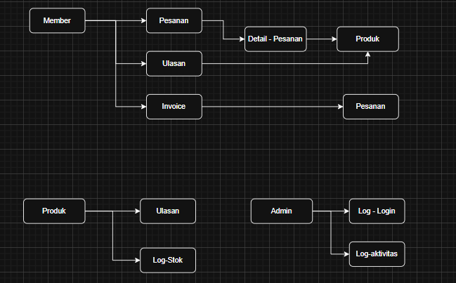

# Toko iPhone - Proyek UAS Web

## 💡 Deskripsi
Aplikasi web penjualan produk Handphone dengan sistem login, transaksi, dan ulasan produk.

## 🛠️ Cara Instalasi
1. Clone/download project dari GitHub/Google Drive.
2. Ekstrak folder ke C:\laragon\www\toko-iphone
3. Buat database dengan nama toko_iphone
4. Import file database: toko_iphone.sql melalui phpMyAdmin
5. Jalankan Laragon/XAMPP
6. Buka browser dan akses http://localhost/toko-iphone

## 🗃️ Struktur Database

1.  member
    Digunakan oleh:
    pesanan.id_pelanggan → FK ke member.id
    ulasan.id_member → FK ke member.id
    invoice.id_member → FK ke member.id

2.  admin
    Tidak ada relasi langsung, tapi bisa muncul di:
    log_login.id_admin → FK ke admin.id
    log_aktivitas.id_admin (jika dicatat aktivitas admin)

3.  produk
    Digunakan oleh:
    detail_pesanan.id_produk → FK ke produk.id
    ulasan.id_produk → FK ke produk.id
    log_stok.id_produk → FK ke produk.id

4.  pesanan
    Digunakan oleh:
    detail_pesanan.id_pesanan → FK ke pesanan.id
    invoice.id_pesanan → FK ke pesanan.id

5.  detail_pesanan
    FK ke:
    pesanan.id
    produk.id

6.  ulasan
    FK ke:
    member.id
    produk.id

7.  invoice
    FK ke:
    pesanan.id
    member.id

8.  log_stok
    FK ke:
    produk.id

9.  log_login
    Bisa FK ke:
    admin.id (jika login admin)
    member.id (jika login member)

10. log_aktivitas
    Bisa FK ke:
    admin.id atau member.id
    Bisa juga tidak punya FK langsung (hanya mencatat teks aktivitas + timestamp)

## 📚 Cara Menggunakan Aplikasi
1.  Login sebagai Admin / Member:
    - Admin: ojanksite/admin/login.php
    Username: admin
    Password: admin123

    - Member: ojankphone.site
    (Bisa daftar akun terlebih dahulu)
2.  Navigasi Fitur:
    Admin bisa: melihat & tambah produk, lihat log stok, lihat ulasan, kelola admin
    Member bisa: lihat produk, beli produk, beri ulasan
3.  Penjelasan Modul:
    produk.php → halaman detail produk + beli
    member/ulasan.php → form input ulasan
    admin/ulasan.php → melihat ulasan yang sudah masuk
    dll.

